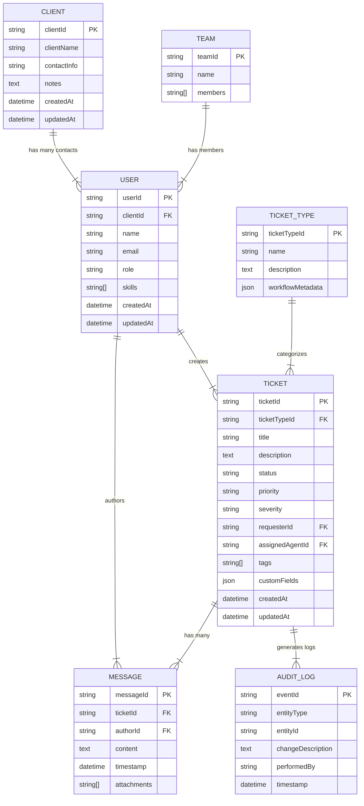

# Detailed Domain Model

## Entity Diagram (Simplified)

## Core Entities

### Client

### Client

- **clientId**: Unique ID for each client org
- **clientName**: Organization name
- **contactInfo**, **notes**: Optional metadata
- **createdAt**, **updatedAt**: Timestamps

### User

- **userId**: Unique user ID
- **clientId**: If user is from a client org, references Client; can be null for internal staff
- **role**: Enum or string (e.g. CLIENT_CONTACT, AGENT, ADMIN, DEVELOPER)
- **skills**: Agent skill tags (optional)

### TicketType

- **ticketTypeId**: Unique ID for each ticket type (e.g., BUG, MAINTENANCE, CONSULTATION)
- **workflowMetadata**: Optional JSON storing advanced or custom workflow rules

### Ticket

- **ticketId**: Unique ticket ID
- **ticketTypeId**: Links to TicketType for specialized workflows
- **title**, **description**: Core request details
- **status**: (New, Open, Pending, Resolved, Closed)
- **priority**: (Low, Normal, High, Urgent)
- **severity**: (None, Minor, Major, Critical) typically for bug/incidents
- **requesterId**: The user who created this ticket (likely role=CLIENT_CONTACT)
- **assignedAgentId**: The internal user or agent assigned
- **tags**, **customFields**: Freeform arrays or JSON for expansions
- **createdAt**, **updatedAt**: Timestamps

### Message

- **messageId**: Unique ID for each message
- **ticketId**: References the associated Ticket
- **authorId**: References the User or "System/AI" placeholder
- **content**: Body text of the message
- **timestamp**: When the message was sent
- **attachments**: Array of file or link references

### Team (Optional for MVP)

- **teamId**: Unique ID for a team
- **name**: E.g., "DevOps" or "Strategy"
- **members**: List of userIds

### AuditLog (Minimal MVP)

- **eventId**: Unique audit ID
- **entityType**: (Ticket, User, etc.)
- **entityId**: The primary key of the entity changed
- **changeDescription**: Freeform text describing the event
- **performedBy**: Who or what performed the change
- **timestamp**: When it occurred

## Domain Operations & Workflows

### Ticket Lifecycle

- createTicket(title, ticketType, priority, severity, description, requesterId)
- assign(agentId or teamId)
- changeStatus(newStatus)
- addMessage(authorId, content, attachments)

### Multi-tenant Client Support

- Distinguish external users (clientId not null) vs. internal staff (null clientId)

### TicketType-based Customization

- Bug vs. Maintenance vs. Consultation: each references a row in TicketType
- Could store advanced routing or specialized statuses in workflowMetadata if needed

### Future Hooks

- AI-based auto-suggestions (via extra fields in Ticket)
- Knowledge Base references
- Analytics or SLA modules

This integrated domain model allows the agency to manage different request types for various client organizations, supporting a multi-tenant structure and flexible workflows for each ticket type.
