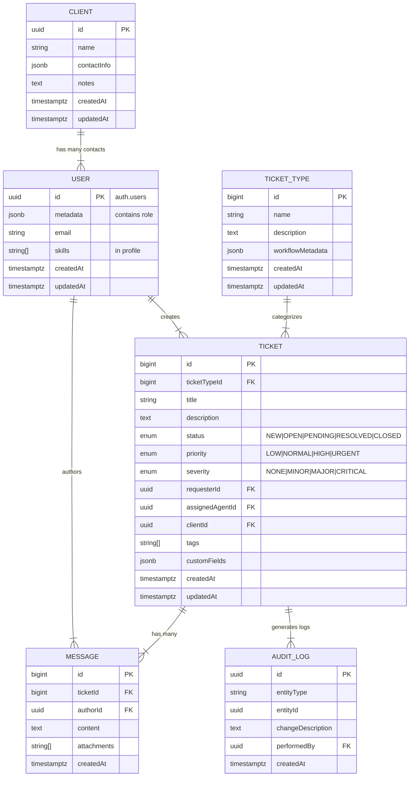

# Detailed Domain Model

## Entity Diagram (Simplified)

## Core Entities

### Client
- **id**: UUID primary key
- **name**: Organization name
- **contactInfo**: JSON for flexible contact details
- **notes**: Optional metadata
- **createdAt**, **updatedAt**: Timestamps

### User (auth.users)
- **id**: UUID primary key
- **metadata**: JSON containing role (CLIENT_CONTACT, AGENT, ADMIN, DEVELOPER)
- **email**: User's email
- Additional profile data in profiles table

### TicketType
- **id**: Auto-incrementing bigint primary key
- **name**: Type identifier (e.g., BUG, MAINTENANCE, CONSULTATION)
- **description**: Detailed description
- **workflowMetadata**: JSON for custom workflow rules
- **createdAt**, **updatedAt**: Timestamps

### Ticket
- **id**: Auto-incrementing bigint primary key
- **ticketTypeId**: References TicketType
- **title**, **description**: Core request details
- **status**: Enum (NEW, OPEN, PENDING, RESOLVED, CLOSED)
- **priority**: Enum (LOW, NORMAL, HIGH, URGENT)
- **severity**: Enum (NONE, MINOR, MAJOR, CRITICAL)
- **requesterId**: References auth.users
- **assignedAgentId**: References auth.users (optional)
- **clientId**: References clients
- **tags**, **customFields**: Array and JSON for extensibility
- **createdAt**, **updatedAt**: Timestamps

### Message
- **id**: Auto-incrementing bigint primary key
- **ticketId**: References ticket
- **authorId**: References auth.users
- **content**: Message text
- **attachments**: Array of attachment references
- **createdAt**: Timestamp

### AuditLog
- **id**: UUID primary key
- **entityType**: Type of entity changed
- **entityId**: ID of the changed entity
- **changeDescription**: Description of the change
- **performedBy**: References auth.users
- **createdAt**: Timestamp

## Access Control

### Row Level Security (RLS)
All tables have RLS enabled with the following policies:

#### TicketTypes
- All authenticated users can view
- Only admins can modify

#### Tickets
- Users can view tickets they:
  - Created
  - Are assigned to
  - Have admin/agent role
- Any authenticated user can create tickets
- Only creators, assigned agents, or admins can update

#### Messages
- Users can view/create messages for tickets they have access to

#### AuditLogs
- Admins can view all logs
- Users can view logs for their tickets

## Domain Operations & Workflows

### Ticket Lifecycle
- createTicket(title, ticketType, priority, severity, description, requesterId)
- assign(agentId)
- changeStatus(newStatus)
- addMessage(authorId, content, attachments)

### Multi-tenant Support
- Clients are isolated by RLS policies
- Role-based access through auth.users metadata

### TicketType Customization
- Default types: BUG, MAINTENANCE, CONSULTATION, SUPPORT
- Extensible through workflowMetadata

### Future Considerations
- AI-based suggestions
- Knowledge Base integration
- Analytics and SLA tracking

This integrated domain model allows the agency to manage different request types for various client organizations, supporting a multi-tenant structure and flexible workflows for each ticket type.
